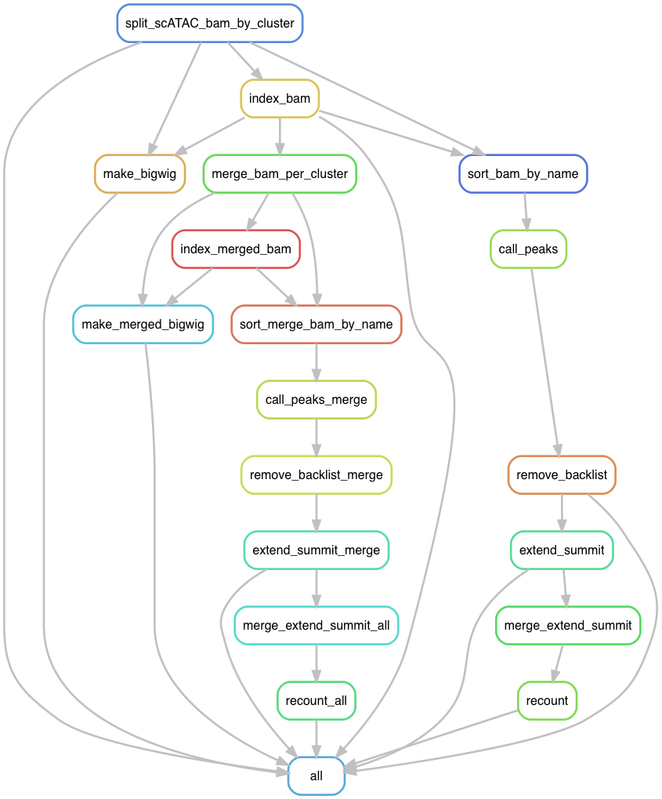

# pyflow-scATACseq
snakemake workflow for post-processing scATACseq data

cite [](https://doi.org/10.5281/zenodo.3946832) if you use it:)

### What does it do?

for single cell ATACseq experiment, one gets a merged bam file for all cells. After going through clustering, one groups similar cells into cell types (cell states). This workflow will split the bam by clusters to create a pseudo bulk bam for each cluster, create bigwig tracks for visulization, call peaks for each cluster and merge the peaks across the clusters. Finally it will count reads per peak per cell from the original bam file on the merged peaks.

Thanks [Brent Pedersen](https://github.com/brentp) for the `rcbbc` (Read Count By BarCode) in the scripts folder.
This script can be very useful in general. It counts the number of reads per cell in regions specified in a bed format from the bam file, which contains `CB` tag for each cell. The code is written in `nim` and is super fast. For over 1 million regions for over 8000 cells in a ~64G bam, it took ~40 mins.


```bash 
./rcbbc -h
rcbbc

read-count by barcode

Usage:
  rcbbc [options] bed bam

Arguments:
  bed
  bam

Options:
  -f, --fasta=FASTA          path to fasta. required only for CRAM
  -e, --exclude=EXCLUDE      exclude alignments with any of these bits set (default: 1796)
  -m, --min-mapping-quality=MIN_MAPPING_QUALITY
                             exclude alignments with a mapping-quality below this (default: 1)
  -w, --white-list=WHITE_LIST
                             line-delimited list of barcodes to include. default is to include any seen in the bam
  -t, --tag=TAG              tag on which to partition read-counts (default: CB)
  -p, --prefix=PREFIX        output prefix for files written by rcbbc (default: rcbbc)
  -h, --help                 Show this help
```

In the future, the peak calling software should be barcode aware, so one does not need to split the bam file by cluster. But for now, I have this work for me.

### workflow of the piepline




### Dependencies

* [snakemake](https://snakemake.readthedocs.io/en/stable/) >=5.4.5. Note snakemake is python3 based.
* [deeptools](https://deeptools.readthedocs.io/en/develop/) >= 3.1.3. We use `bamCoverage` from it to make bigwig files.
* [Genrich](https://github.com/jsh58/Genrich) for calling peaks. It implements ATACseq peak calling with internal +4/-5bp shifting. Develped by John, our previous group member at [Harvard FAS informatics](https://informatics.fas.harvard.edu/).
* [bedtools](https://bedtools.readthedocs.io/en/latest/) >= 2.27.1 for manipulating bed files.
* [samtools](http://www.htslib.org/) >=1.9 for manipupating bam files.


### How to use this pipeline

1. clone the repo 

```bash
git clone https://github.com/crazyhottommy/pyflow-scATACseq
cd pyflow-scATACseq
```

2. Prepare a tab delimited `tsv` file with header: `meta.tsv` inside the `pyflow-scATACseq` folder:

| sample  | bam_path         | cluster_id.csv               | white_list                      | 
|---------|------------------|------------------------------|---------------------------------| 
| sample1 | /path/to/sample1.bam | /path/to/sample1.csv | /path/to/white_list_sample1.txt | 
| sample2 | /path/to/sample2.bam | /path/to/sample2.csv | /path/to/white_list_sample2.txt | 


  * The first column is the sample name.  
  * The second column is the path to the `10x cellranger_atac` produced `possorted_bam.bam`  
  * The `cluster_id.csv` is a two column csv file **with** header (does not matter what name you give). The first column is the cell barcode, the second column is the cluster id (can be numeric or strings).

**make sure the cluster_id.csv is named exactly as sample.csv**. 

e.g. if the sample column is sample1, it should be sample1.csv for the cluster information csv file.


```
cat example_cluster.csv
name,value
AAACGAAAGCACCATT-1,32
AAACGAAAGTAGTCGG-1,4
AAACGAAGTAACGGCA-1,31
AAACTCGAGAACAGGA-1,17
AAACTCGAGTCCAGAG-1,1
AAACTCGCAAAGGAAG-1,41
AAACTCGCAAGGCGTA-1,5
AAACTCGCAGAAAGAG-1,4
AAACTCGCAGTAGGCA-1,24
```
  * The white_list is a one column txt file with valid barcode you want to include.

you can create it by:

```bash
cat example_cluster.csv | cut -f1 -d, | sed '1d' > example_white_list.txt
```

2. Create a `samples.json` file:

```bash
python sample2json.py meta.tsv

# a samples.json file will be created
cat samples.json
{
    "sample1": [
        "/path/to/sample1.bam",
        "/path/to/sample1.csv",
        "/path/to/white_list_sample1.txt"
    ],
    "sample2": [
        "/path/to/sample2.bam",
        "/path/to/sample2.csv",
        "/path/to/white_list_sample2.txt"
    ]
}
```

3. Running the workflow

```bash
#dry run
snakemake -np 

## real-run on local machine
snakemake -j 10


## if you want to use a singularity image that contains presto for differential accessible test
snakemake -j 10 --use-singularity

## submit to slurm (you can change this script for your own HPC)
./pyflow-scATACseq.sh 
```


### To-do list

- [ ] check file paths exist and format.
- [ ] Have a conda env set up for the Snakefile.  
- [ ] have a docker container.  
- [ ] Motif analysis.  
- [ ] Find differential peaks using presto.
- [ ] Associating peaks with genes using Cicero
- [ ] Gene set enrichment


### Other Notes 

more thoughts on pileup and shifting reads
https://github.com/deeptools/deepTools/issues/453
maxFragmentLength

https://github.com/deeptools/deepTools/issues/370

https://groups.google.com/forum/#!topic/deeptools/JU9itiT5rYk

You probably want “–Offset 1”

The above is not shifting exactly, for shifting use
https://deeptools.readthedocs.io/en/develop/content/tools/alignmentSieve.html

--ATACshift

filter out fragments?